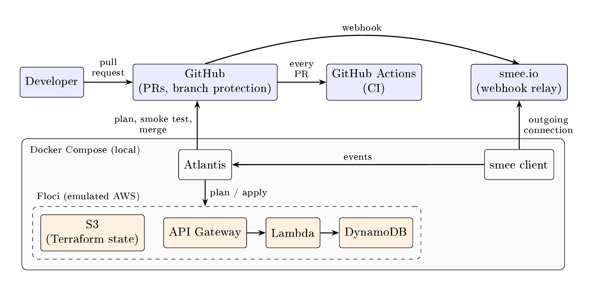

# URL shortener with a PR-driven DevOps pipeline

A small serverless URL shortener (AWS Lambda, API Gateway, DynamoDB), deployed
through a pull-request-driven pipeline. The AWS infrastructure runs locally in
[Floci](https://github.com/floci-io/floci), an open-source AWS emulator, so no
cloud account is needed.

## Getting started

There are three ways to try the project, depending on how much you want to set up:

| Option | Requirements | Description |
|---|---|---|
| Run the CI pipeline | A GitHub account | Fork the repository, enable Actions, and run the **CI** workflow from the Actions tab. It deploys the stack to Floci and runs all tests. |
| Run it locally | See [Prerequisites](#prerequisites) | See [Running locally](#running-locally). |
| Run the full CD pipeline | The local setup, plus a GitHub token and a smee.io channel | See [Setting up Atlantis](#setting-up-atlantis). |

Example runs:
- [Pull request deployed by Atlantis](https://github.com/Gabjea/devops-project/pull/6): plan, apply, smoke test and automatic merge
- [CI run with all jobs passing](https://github.com/Gabjea/devops-project/actions/runs/38045115012)
- [CI run that caught a problem](https://github.com/Gabjea/devops-project/pull/16)

## Architecture


## The pipeline

| Requirement | Implementation |
|---|---|
| **CI** | GitHub Actions on every pull request: unit tests, `terraform fmt`/`validate`, Checkov, pip-audit, and integration tests against an ephemeral Floci environment ([ci.yml](.github/workflows/ci.yml)) |
| **CD** | Atlantis posts the Terraform plan on each pull request. Commenting `atlantis apply` deploys to the persistent environment, runs a [smoke test](scripts/smoke_test.sh), and merges the PR. Applies require all CI checks to pass ([repos.yaml](atlantis/repos.yaml)) |
| **Infrastructure as Code** | Terraform for all AWS resources ([infra/](infra/)), with remote state in S3; Docker Compose for the local setup ([docker-compose.yml](docker-compose.yml)) |
| **Development platform** | GitHub: pull requests, branch protection on `main`, required status checks |
| **Quality and security automation** | Checkov (Terraform misconfigurations, justified skips in [main.tf](infra/main.tf)), pip-audit, Dependabot, GitHub secret scanning and push protection |


Every change follows the same path: pull request → CI → Atlantis plan → `atlantis apply` → smoke test → automatic merge.

## Prerequisites

| Tool | Version | Used for |
|---|---|---|
| [Docker](https://docs.docker.com/get-docker/) with Docker Compose v2 | recent | Running Floci, Atlantis and the Lambda containers |
| [Terraform](https://developer.hashicorp.com/terraform/install) | 1.13.0 (same as CI) | Deploying the infrastructure |
| [AWS CLI](https://docs.aws.amazon.com/cli/latest/userguide/getting-started-install.html) | v2 | Creating the state bucket |
| [Floci CLI](https://github.com/floci-io/floci-cli) | latest | Setting the AWS environment variables for Floci |
| [Python](https://www.python.org/downloads/) | 3.12 (same as the Lambda runtime) | Running the tests |

Floci needs access to the Docker socket
(`/var/run/docker.sock`) to start Lambda containers.

No AWS account is needed: Floci accepts dummy credentials. To point the AWS CLI
at Floci, run this in each new terminal:

```bash
eval $(floci env)
```

## Running locally

```bash
docker compose up -d                  # start Floci
./scripts/bootstrap-state.sh          # create the Terraform state bucket
cd infra
terraform init
terraform apply                       # first-time setup; later changes go through Atlantis

API=$(terraform output -raw api_url)
curl -s -X POST "$API/links" -d '{"url":"https://www.kth.se"}'   # -> {"code": "..."}
curl -i "$API/links/<code>"                                       # -> 302 redirect
```

Tests:

```bash
cd app
python3 -m venv .venv && source .venv/bin/activate
pip install -r requirements-dev.txt
pytest                                                                       # unit tests
API_URL=$(terraform -chdir=../infra output -raw api_url) pytest integration_tests
```

## Setting up Atlantis

Atlantis comments on and merges pull requests, so it needs a GitHub token for the
repository it manages. This is the only part of the project that requires an
account-specific secret.

1. Create a webhook channel at https://smee.io/new.
2. Create a fine-grained GitHub token for this repository, with read and write
   access to Contents, Pull requests, Issues and Commit statuses.
3. Generate a webhook secret: `openssl rand -hex 32`.
4. Copy `.env.example` to `.env` and fill in the values (`.env` is git-ignored).
5. Add a repository webhook: the smee URL as payload URL, content type
   `application/json`, the secret from step 3, and the events Issue comments,
   Pull requests, Pull request reviews and Pushes.
6. Start everything: `docker compose --profile atlantis up -d`

**Troubleshooting:** if pulling the Atlantis image fails with `denied`, Docker is
sending old or expired GitHub credentials for `ghcr.io`. The image is public, so
log out and try again:

```bash
docker logout ghcr.io
docker compose --profile atlantis up -d
```

## Repository layout

| Path | Contents |
|---|---|
| `app/` | Lambda handler (`src/`), unit tests (`tests/`), integration tests (`integration_tests/`) |
| `infra/` | Terraform configuration |
| `atlantis.yaml`, `atlantis/` | Atlantis project and server configuration |
| `scripts/` | State bucket bootstrap and smoke test |
| `.github/` | CI workflow and Dependabot configuration |
| `docker-compose.yml` | Floci, Atlantis and the webhook relay |